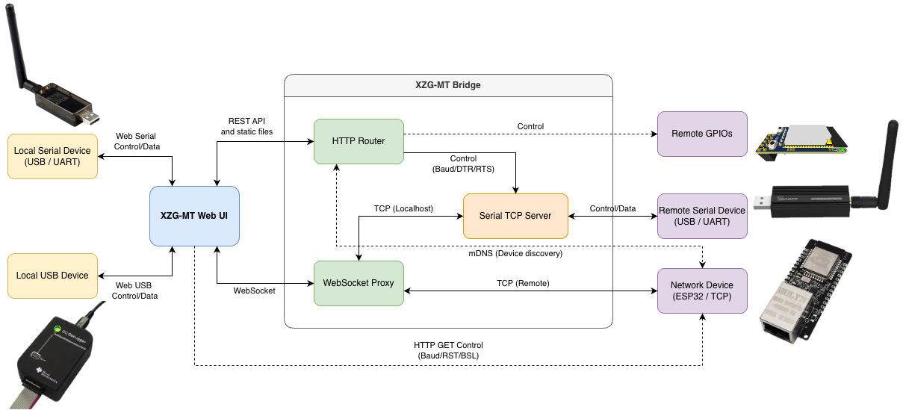

# XZG Multi-tool

<div align="center">
  
</div>

---

<div align="center"> 
<a href="https://github.com/xyzroe/XZG-MT/releases"></img></a>
<a href="https://github.com/xyzroe/XZG-MT/actions/workflows/build-binaries.yml"></img></a>
<a href="https://github.com/xyzroe/XZG-MT/releases/latest"></img></a>
<a href="https://github.com/xyzroe/XZG-MT/pkgs/container/xzg-mt"></img></a>
<a href="https://github.com/xyzroe/XZG-MT/issues"></img></a>
<a href="LICENSE"></img></a>
</div>

## 📖 About

The XZG Multi-Tool is a browser-based flashing solution that enables hobbyists and developers to program Texas Instruments, Silicon Labs, Espressif, Arduino and Telink devices. It provides a simple, polished web UI that enables users to flash adapters directly from the browser, eliminating the need for client software installation.

The web front end performs local flashing via the WebSerial and WebUSB APIs, offering automatic device detection and convenient firmware flashing features. The bridge component (WebSocket ↔ TCP) enables headless or remote hosts to expose local serial ports via TCP and connect them to the web UI. The bridge also supports connecting to remote TCP-based adapters, enabling access to networked adapters from any browser.

## ⭐ Features

- 🔌 Work with various devices locally via WebSerial/WebUSB or remotely via bridge.
- 📂 Flash firmware from a local file or select from a provided list.
- 📝 List of cloud firmware with descriptions
- 🦾 Automatically detects chip model, flash size, IEEE, and firmware version
- 💾 Backup, restore, and erase NVRAM

## 💻 Supported Chips

For a complete, up-to-date list of supported devices, features, and device-specific notes, see the [devices table](/docs/devices.md).

## 🏗️ Architecture

<div align="center">

 <picture>
   <source media="(prefers-color-scheme: dark)" srcset="docs/imgs/dark.png" />
   <source media="(prefers-color-scheme: light)" srcset="docs/imgs/light.png" />
   
 </picture>

</div>

## 🚀 Quick start

### 🔌 Local USB

<div align="center"> 
🌐 Open: <a href="https://mt.xyzroe.cc" target="_blank">mt.xyzroe.cc</a><br>
<i>from Chrome or Edge</i>
</div>

### 📡 Remote (TCP or remote USB/serial)

Because browsers don't support TCP connections you need to use WebSocket ↔ TCP bridge that can forward WebSocket clients to TCP hosts and as option expose local serial ports over TCP.

You have some options:

#### 🏠 Home Assistant Add-On

<div align="center"> 
<a alt="Open your Home Assistant instance and show the add add-on repository dialog with a specific repository URL pre-filled." href="https://my.home-assistant.io/redirect/supervisor_add_addon_repository/?repository_url=https%3A%2F%2Fgithub.com%2Fxyzroe%2FXZG-MT" target="_blank"></img></a>
</div>
 
Just click on the button above or add this repository to your Home Assistant add-on store manually and then install the add-on to expose remote TCP / host serial devices to the web UI.

#### 🐳 Docker images

Prebuilt multi-arch images are published to [GHCR](https://github.com/xyzroe/XZG-MT/pkgs/container/xzg-mt) on each release.

Latest image: `ghcr.io/xyzroe/XZG-MT:latest`  
Special version image: `ghcr.io/xyzroe/XZG-MT:<tag>` (e.g. `v0.1.1`)

<details>
  <summary>Running instructions:</summary>
- Run (basic):

```bash
docker run --rm -p 8765:8765 ghcr.io/xyzroe/XZG-MT:latest
```

- Run with mDNS:

```bash
docker run --rm --network host ghcr.io/xyzroe/XZG-MT:latest
```

- To expose a host serial device to the container add `--device` (Linux):

```bash
docker run --rm --network host \
  --device /dev/ttyUSB0:/dev/ttyUSB0 \
  ghcr.io/xyzroe/XZG-MT:latest
```

- Customize port, advertised host, disable serial scan and enable debug logs:

```bash
docker run --rm \
  -e PORT=9000 \
  -e ADVERTISE_HOST=192.168.1.42 \
  -e DEBUG_MODE=true \
  -p 9000:9000 \
  ghcr.io/xyzroe/XZG-MT:latest
```

</details>

#### 📦 Prebuilt binaries

Download a ready-to-run binary from [Releases](https://github.com/xyzroe/XZG-MT/releases), make it executable (Linux/macOS), and run.

<details>
  <summary>⚡ How to run:</summary>

##### Windows:

- Run: `XZG-MT-windows-*.exe` or double click

##### Linux:

<details>
  <summary>Select the correct binary for your platform</summary>
  
- linux/arm64 — aarch64_generic, aarch64, arm64
- linux/arm — armhf, arm_cortex-a7_neon-vfpv4, arm_cortex-a9_neon
- linux/amd64 — amd64
- linux/386 — i386 / 32-bit x86
- linux/mips — mips_24kc
- linux/mipsle — mipsel_24kc
- linux/mips64 — mips64
- linux/mips64le — mips64le

Note: linux/arm targets ARMv7 (GOARM=7). MIPS and MIPSLE builds use GOMIPS=softfloat for compatibility with older devices (for example, MT7688).

</details>
<br>  
 
 
1. Make executable:

```bash
chmod +x ./XZG-MT-linux-*
```

2. Run: `./XZG-MT-linux-*` or double click

##### macOS:

1. Make executable and remove quarantine:

```bash
chmod +x ./XZG-MT-darwin-*
xattr -d com.apple.quarantine ./XZG-MT-darwin-*
```

2. Run: `./XZG-MT-darwin-*` or double click

To run on custom port: `./XZG-MT-* 9999`

</details>

## 📚 Where to read more

For step-by-step guides and detailed documentation, explore the following:

- 📚 How-To Guides: [Start here](docs/how-to/readme.md)
- 🌐 Web UI: [README](web-page/README.md)
- 🚀 WebSocket bridge — [README](bridge/README.md)
- 🏠 Home Assistant add-on: [README](xzg-multi-tool-addon/README.md)
- 🤖 AI Generated Wiki: [DeepWiki](https://deepwiki.com/xyzroe/XZG-MT)

## 👥 Community

<div align="center">
  <a href="https://t.me/xzg_fw"></a>
  <a href="https://discord.gg/A5ge3cYRKW"></a>
</div>

## 💖 Support

If you find this project useful and want to support further development, you can sponsor or donate to the author:

<div align="center">
  <a href="https://github.com/xyzroe" title="GitHub Sponsors"></a>
  <a href="https://www.buymeacoffee.com/xyzroe" title="Buy Me a Coffee"></a>
  <a href="https://www.paypal.com/paypalme/xyzroe" title="PayPal Me"></a>
  <a href="https://nowpayments.io/donation/xyzroe" title="Crypto donation via NOWPayments"></a>
<br>
</div>

Thank you — every little contribution helps keep the project alive and maintained. 🙏

## 🌟 Star History

If you find this project useful, please consider giving it a ⭐ on GitHub!

<div align="center">
<a href="https://www.star-history.com/#xyzroe/XZG-MT&Date">
 <picture>
   <source media="(prefers-color-scheme: dark)" srcset="https://api.star-history.com/svg?repos=xyzroe/XZG-MT&type=Date&theme=dark" />
   <source media="(prefers-color-scheme: light)" srcset="https://api.star-history.com/svg?repos=xyzroe/XZG-MT&type=Date" />
   
 </picture>
</a>
</div>

## 🛠️ Tech badges

Below are key technologies used across the projects (click the badges for quick context):

<div align="center">
  <a href="web-page/package.json"></a>
  <a href="web-page/tsconfig.json"></a>
  <a href="web-page/package.json"></a><br>
  <a href="web-page/src/transport/serial.ts"></a>
  <a href="web-page/src/tools/cc-debugger.ts"></a>
  <a href="web-page/src/transport/tcp.ts"></a><br>
  <a href="bridge/go.mod"></a>
  <a href="bridge/mdns.go"></a>
  <a href="bridge/Dockerfile"></a>
</div>

## 📁 Repository structure

- web-page/ — The web frontend. Contains source TypeScript, build scripts, favicon and static assets.
- bridge/ - The small Go app that bridges WebSocket ↔ TCP, supports mDNS discovery and exposing local serial ports as TCP servers.
- xzg-multi-tool-addon/ — Home Assistant add-on wrapper for the bridge.
- docs - Folder consisting the documentation about this project.
- LICENSE — License for the whole repository (MIT).
- repository.json — repository metadata.

## 📜 License

MIT — see [`LICENSE`](LICENSE) for details.

## 🙏 Acknowledgements

Built on the shoulders of giants:

- **Texas Instruments CCXX52 and CC2538** — inspired by
  - [cc2538-bsl](https://github.com/JelmerT/cc2538-bsl) by Jelmer Tiete
  - [zigpy-znp](https://github.com/zigpy/zigpy-znp) by Open Home Foundation
- **Silicon Labs** — inspired by
  - [universal-silabs-flasher](https://github.com/NabuCasa/universal-silabs-flasher) by Nabu Casa
- **Espressif Systems** — powered by
  - [esptool-js](https://github.com/espressif/esptool-js) by
    Espressif Systems
- **Texas Instruments CC25XX**
  - **СС Debugger** — inspired by
    - [cc-tool](https://github.com/scott-42/cc-tool) by Scott Gustafson
  - **СС Loader** — inspired by
    - [CC Loader](https://github.com/RedBearLab/CCLoader) by RedBearLab
    - [CC Loader fork](https://github.com/tjko/CCLoader) by Timo Kokkonen
- **Arduino** — inspired by
  - [arduino-web-uploader](https://github.com/dbuezas/arduino-web-uploader) by David Buezas
- **Telink** - inspired by
  - [TlsrComProg825x](https://github.com/pvvx/TlsrComProg825x) by pvvx Viktor
  - [TlsrComProg](https://github.com/pvvx/TlsrComProg) by pvvx Viktor
  - [TLSRPGM](https://github.com/pvvx/TLSRPGM) by pvvx Viktor

---

<div align="center">
  <sub>Made with <span aria-hidden="true">❤️</span> from Berlin!</sub>
</div>
  
---
