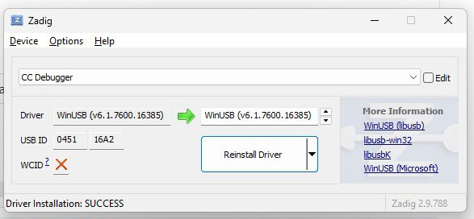
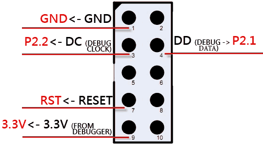

# How to Use CC Debugger for Flashing CC2530 Chips

## 📖 Introduction

The CC2530 is a System-on-Chip (SoC) from Texas Instruments, commonly used in Zigbee applications, smart home devices, and IoT projects. The best way to flash firmware onto CC2530 chips requires a special programmer. This guide covers using the TI CC Debugger or SmartRF04EB to program CC2530 family chips using the XZG-MT.

## 🔧 Required Hardware

- **Programmer**: Texas Instruments CC Debugger or SmartRF04EB
- **CC2530 device**: The target device to be flashed.
- **USB Cable**: For connecting the debugger to your host device.
- **Host device**: Computer (Windows, Linux, macOS) or Android device

## 💻 Driver Installation

### Linux, macOS, and Android

These operating systems support plug-and-play for the CC Debugger and SmartRF04EB. No additional drivers are required.

1. Connect the debugger to your host device via USB.
2. The device should be recognized automatically.

### Windows

Windows requires installing the WinUSB driver for proper communication with the debugger.

1. Download Zadig from the [official website](https://zadig.akeo.ie/).
2. Run Zadig as an administrator.
3. Connect your CC Debugger or SmartRF04EB to your computer.
4. In Zadig, select the device from the dropdown (it may appear as "Texas Instruments CC Debugger" or similar).
5. Choose "WinUSB" from the driver list.
6. Click "Install Driver" or "Replace Driver".

If you have previously installed the SmartRF Flash Programmer from TI, your system may have the CEBAL driver installed. You need to replace it with WinUSB using Zadig as described above.

After installation, verify in Device Manager that the device is listed under "Universal Serial Bus devices" with "WinUSB" driver.

## ⚡ Flashing Procedure

1. **Prepare Your Setup**:

   - Ensure the CC2530 chip is properly connected to the debugger.
     
   - Power on the target device if required.

2. **Open XZG-MT**:

   - Open the [XZG-MT](https://mt.xyzroe.cc) on your host device.

3. **Select Chip Family**:

   - In XZG-MT, select the `TI CC25XX` in Family section.

4. **Connect Debugger**:

   - Click the `Connect Debugger` button.
   - Web browser should display list of compatible devices, select yours and click `Connect`.
   - XZG-MT will detect programmer's model and firmware version and chip's model and IEEE.

5. **Load Firmware**:

   - Select the firmware file (`.hex` or `.bin`) you want to flash.

6. **Flash the Chip**:

   - Select the options you need (Erase, Write and Verify).
   - Select writing and verifying methods.
   - Click the `Start` button in XZG-MT.
   - Wait for the process to complete. The progress should be displayed in the interface. More information can be found in `Logs` section.

7. **Verify**:
   - After flashing, verify that the device functions as expected.

## 💾 Dump flash to a file

XZG-MT allows to read device's flash and save it to a local file.

1. Connect to device as described above (1-4)
2. Click on `Dump flash` button in the `Actions` section.
3. Wait until all data will be read. The progress should be displayed in the interface. More information can be found in `Logs` section.
4. Save file to your host device.

## 🛠️ Troubleshooting

- **Device Not Recognized**: Ensure drivers are installed correctly (especially on Windows). Try a different USB port or cable.
- **Access denied (Windows)**: Ensure that you have installed WinUSB driver and your device is listed under "Universal Serial Bus devices" in Device Manager.
- **Connection Failed**: Check physical connections between debugger and CC2530. Ensure the chip is powered.
- **Flashing Errors**: Verify the firmware file is compatible with CC2530. Check for voltage issues or faulty hardware.
- **Zadig Issues**: Run Zadig as administrator. If the device doesn't appear, try unplugging and replugging the debugger. If it still doesn't show, click Options and select "List All Devices".

## 🆘 If the Problem Persists

If the problem persists after trying the troubleshooting steps, please open an issue on the [XZG-MT GitHub repository](https://github.com/xyzroe/XZG-MT/issues). Provide detailed information about your setup, operating system, error messages, and steps you've taken.
