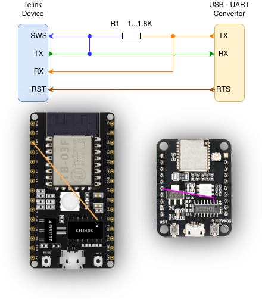
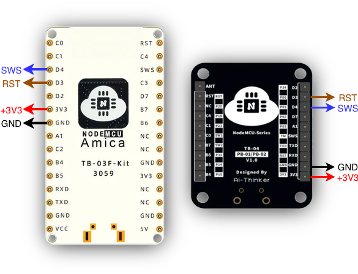

# How to Flash Telink TLSR825x/TLSR826x Chips

## 📖 Introduction

Telink TLSR825x and TLSR826x are System-on-Chip (SoC) solutions commonly used in Zigbee, Bluetooth Low Energy (BLE), and smart home devices. This guide covers two methods for flashing firmware onto Telink chips using XZG-MT.

## 🔌 Connection Methods

XZG-MT supports two connection methods for programming Telink chips:

### Method 1: UART SWire Emulation (TlsrComProg)

This method emulates SWire protocol over a standard UART interface using a special connection scheme. It uses direct SWire access through UART TX/RX pins connected in a specific way.

This method is especially convenient for development boards that already have a built-in USB-to-UART converter, such as **TB-03F-KIT** or **TB-04-KIT**.

 <picture>
   <source media="(prefers-color-scheme: dark)" srcset="imgs/TlsrComProg_dark.png" />
   <source media="(prefers-color-scheme: light)" srcset="imgs/TlsrComProg_light.png" />
   
 </picture>

**Requirements:**

- USB-to-UART adapter (CH340 or PL2303HX) or development board with built-in converter (TB-03F-KIT, TB-04-KIT)
- Target Telink device
- Wires connected according to the diagram (TX, RX tied together to SWS)

**Pros:**

- Simple hardware — uses common USB-to-UART adapters
- Ideal for boards with built-in USB-UART (TB-03F-KIT, TB-04-KIT)
- Can be used to create a UART2SWire programmer from these boards

### Method 2: UART2SWire Programmer (TlsrPgm)

This method uses a dedicated UART2SWire programmer board that converts UART commands to native SWire protocol. The programmer can be created from **TB-03F-KIT** or **TB-04-KIT** boards using XZG-MT (see above).

 <picture>
   <source media="(prefers-color-scheme: dark)" srcset="imgs/TLSRPGM_dark.png" />
   <source media="(prefers-color-scheme: light)" srcset="imgs/TLSRPGM_light.png" />
   
 </picture>

**Requirements:**

- UART2SWire programmer (created from TB-03F-KIT or TB-04-KIT)
- Target Telink device
- Wires for SWS (SWire), RST, GND, and VCC connections

**Pros:**

- Universal — automatically detects chip family (no need to select 825X/826X)
- Native SWire protocol — more reliable communication
- Can program any Telink chip

## ⚡ Flashing Procedure

### Using UART Method

1. **Prepare Your Setup**:

   - Connect USB-to-UART adapter to your computer (or use built-in converter on TB-03F-KIT/TB-04-KIT)
   - Wire the connections according to the diagram above
   - The key is connecting TX and RX together to the chip's SWS pin

2. **Open XZG-MT**:

   - Open [XZG-MT](https://mt.xyzroe.cc) in your browser

3. **Select Chip Family**:

   - In XZG-MT, select `Telink` in the Family section

4. **Configure Connection**:

   - Set Method to `UART`
   - Select chip Family: `825X` or `826X` (must match your target chip)

5. **Connect to Device**:

   - Click `Choose Serial` button
   - Select your USB-to-UART adapter from the list
   - XZG-MT will detect the chip and display its information

6. **Load and Flash Firmware**:
   - Select the firmware file (`.bin`) you want to flash
   - Configure flash options (Erase, Verify)
   - Click `Start` to begin flashing
   - Wait for the process to complete

#### Creating a UART2SWire Programmer

You can create a UART2SWire programmer from a **TB-03F-KIT** or **TB-04-KIT** board using UART method:

1. Connect the TB-03F-KIT or TB-04-KIT to your computer via USB
2. Open [XZG-MT](https://mt.xyzroe.cc) and select `Telink` family
3. Set Method to `UART` and select chip family `825X`
4. Connect to the board using `Choose Serial`
5. In the `Actions` section, click `Flash uart2swire` button
6. Wait for the firmware to be flashed
7. Your board is now a UART2SWire programmer!

### Using SWire Method

1. **Prepare Your Setup**:

   - Connect UART2SWire programmer to your computer via USB
   - Connect programmer's SWS output to target chip's SWS pin
   - Connect RST, GND, and VCC appropriately
   - Power on the target device

2. **Open XZG-MT**:

   - Open [XZG-MT](https://mt.xyzroe.cc) in your browser

3. **Select Chip Family**:

   - In XZG-MT, select `Telink` in the Family section

4. **Configure Connection**:

   - Set Method to `Swire`
   - No need to select chip family — it will be detected automatically

5. **Connect to Programmer**:

   - Click `Choose Serial` button
   - Select your UART2SWire programmer from the list
   - XZG-MT will communicate with the programmer and detect the target chip

6. **Load and Flash Firmware**:
   - Select the firmware file (`.bin`) you want to flash
   - Configure flash options (Erase, Verify)
   - Click `Start` to begin flashing
   - Wait for the process to complete

## 💾 Dump Flash to a File

XZG-MT allows reading the device's flash memory and saving it to a local file.

1. Connect to the device using either method described above
2. Click on `Dump flash` button in the `Actions` section
3. Wait until all data is read. Progress is displayed in the interface
4. Save the file to your computer

## 🛠️ Troubleshooting

### UART Method Issues

- **Device Not Detected**:

  - Verify the wiring matches the diagram (TX and RX should be connected together to SWS)
  - Ensure you selected the correct chip family (825X or 826X)

- **Communication Errors**:
  - Ensure proper GND connection
  - Check for loose wires

### SWire Method Issues

- **Programmer Not Responding**:

  - Verify the programmer was flashed correctly
  - Try reconnecting the USB
  - Check that the programmer has power

- **Target Chip Not Detected**:
  - Verify SWS pin connection
  - Check RST connection
  - Ensure target chip is powered
  - Check GND connection between programmer and target

### General Issues

- **Flashing Errors**: Verify the firmware file is compatible with your chip model
- **Verification Failed**: Try erasing the chip first, then flash again
- **Bricked Device**: Use SWire method with UART2SWire programmer to recover

## 🆘 If the Problem Persists

If the problem persists after trying the troubleshooting steps, please open an issue on the [XZG-MT GitHub repository](https://github.com/xyzroe/XZG-MT/issues). Provide detailed information about your setup, operating system, error messages, and steps you've taken.
